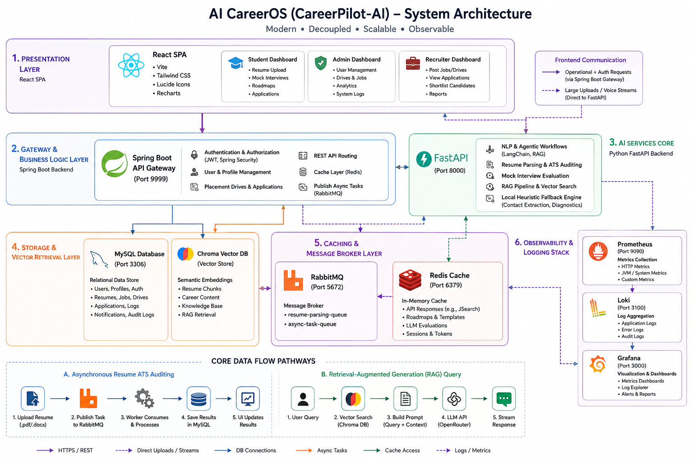
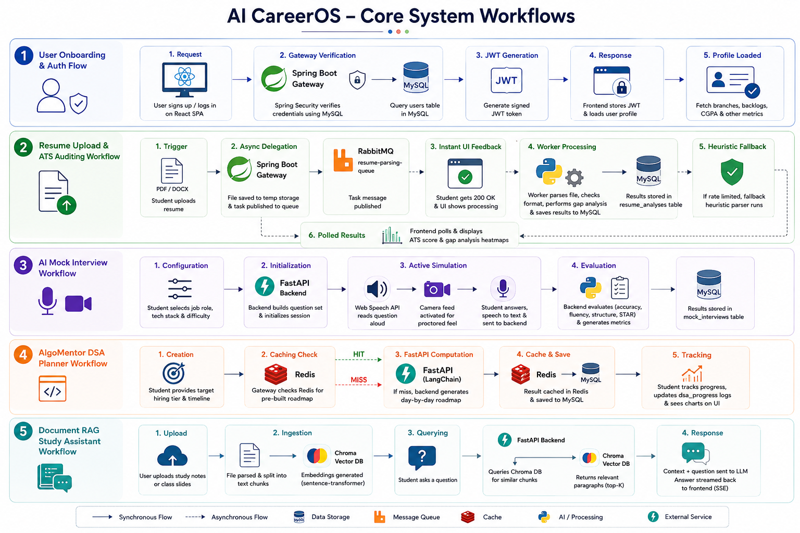
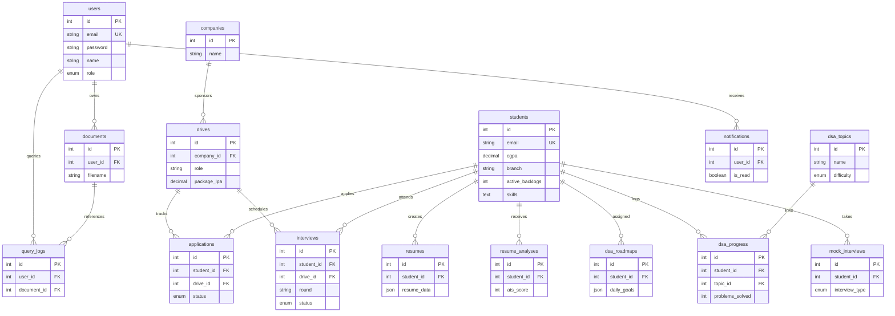
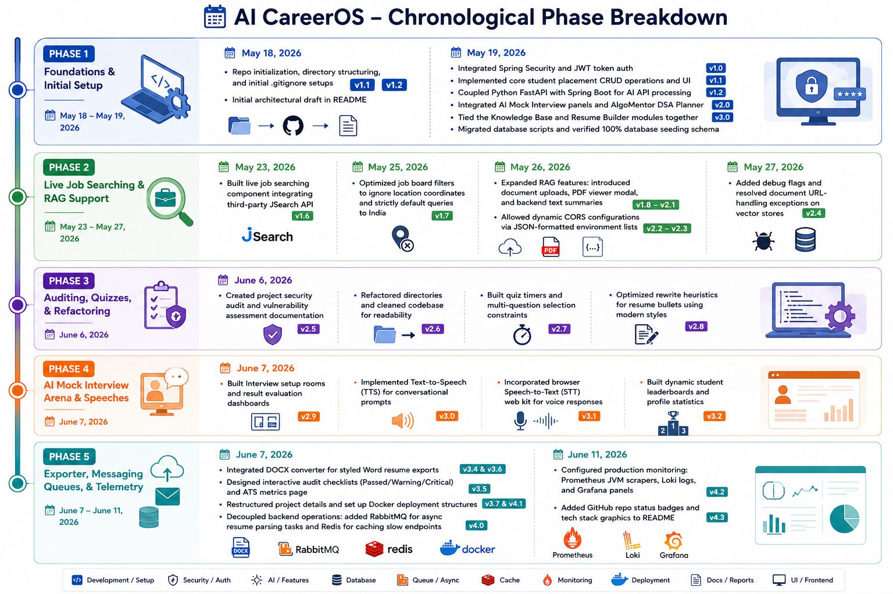

# AI CareerOS — Unified AI Career Ecosystem

<div align="center">

[](https://github.com/AnishaPaturi/CareerPilot-AI/stargazers)
[](https://github.com/AnishaPaturi/CareerPilot-AI/network/members)
[](https://github.com/AnishaPaturi/CareerPilot-AI/issues)
[](https://github.com/AnishaPaturi/CareerPilot-AI/pulls)

</div>

<div align="center">

[](https://www.oracle.com/java/)
[](https://spring.io/projects/spring-boot)
[](https://www.python.org/)
[](https://fastapi.tiangolo.com/)
[](https://react.dev/)
[](https://tailwindcss.com/)
[](https://www.mysql.com/)

</div>

AI CareerOS (also known as **CareerPilot-AI**) is a unified, intelligent career preparation and placement ecosystem. Instead of relying on disconnected tools, the platform consolidates placement management, automated resume auditing, mock interview simulation, DSA roadmapping, and document RAG-based study assistants into a single unified product.

Designed with a high-performance microservices blueprint, it is built to demonstrate startup-level system design and software architecture.

---

## 🏗️ System Architecture

The platform uses a decoupled backend design: an enterprise-level Spring Boot gateway that manages relational data and role authentication, alongside a Python FastAPI microservice that drives all LLM, RAG, and vector operations.



---

## 🔄 System Workflow



---

## 🛠️ Technology Stack


| Layer | Technology | Key Capabilities |
| --- | --- | --- |
| **Frontend** | React (Vite), Tailwind CSS, Lucide Icons, Recharts | Dynamic dashboards, responsive controls, visual analytics, charts |
| **Primary Backend** | Spring Boot, Hibernate / JPA, Spring Security | Role-based authorization, JWT generation, placement tracking |
| **Relational Database** | MySQL | Relational data, user authentication, application logging |
| **AI Services Core** | Python FastAPI, Uvicorn | High-performance async API, LangChain integration |
| **Vector Database** | ChromaDB, Sentence Transformers | Semantic document embeddings, RAG retrieval |
| **AI Integrations** | OpenRouter API, LangChain Orchestration | Multi-LLM model failovers, local heuristic fallback engines |
| **Document Utilities** | python-docx, pdfplumber, Web Speech API | Parsing PDFs, compiling structured `.docx` files, voice inputs |

---

## 📂 Database Design

The relational database is managed by MySQL. The schema initializes automatically on backend startup from the [schema.sql](file:///C:/Users/anish/OneDrive/College/Projects/AI-CareerOS/backend/src/main/resources/schema.sql) file.

### 📐 Entity-Relationship (ER) Diagram



### 🗄️ Relational Schema Layout (Modular Grouping)

#### 🔑 Core Accounts & Profiles
| Table | Description | Primary / Foreign Keys |
| :--- | :--- | :--- |
| **`users`** | Central login accounts supporting Student, Admin, and Recruiter credentials. | `id` (PK) |
| **`students`**| Detailed profiles tracking CGPA, branch, backlogs, skills, education, and experience. | `id` (PK) |

#### 💼 Placement Drive System
| Table | Description | Primary / Foreign Keys |
| :--- | :--- | :--- |
| **`companies`**| Profiles of corporate recruiters and partner organizations. | `id` (PK) |
| **`jobs`** | Indexed postings from internal sources and JSearch API feeds. | `id` (PK), `company_id` (FK) |
| **`drives`** | Active campus recruitment drives listing target CTC/LPA and criteria. | `id` (PK), `company_id` (FK) |
| **`applications`**| Track state changes (`APPLIED`, `SHORTLISTED`, `SELECTED`, `REJECTED`). | `id` (PK), `student_id` (FK), `drive_id` (FK) |
| **`interviews`**| Chronological corporate interview rounds, scores, and feedback remarks. | `id` (PK), `student_id` (FK), `drive_id` (FK) |

#### 🤖 Resume Builder & AI Analytics
| Table | Description | Primary / Foreign Keys |
| :--- | :--- | :--- |
| **`resumes`** | Structured JSON layouts storing template styles and user resume texts. | `id` (PK), `student_id` (FK) |
| **`resume_analyses`**| Historical logs capturing ATS scores, missing keywords, and layout critiques. | `id` (PK), `student_id` (FK) |
| **`mock_interviews`**| Simulation transcripts, parsed questions, and technical/HR evaluation matrices. | `id` (PK), `student_id` (FK) |

#### 📈 AlgoMentor DSA Tracker
| Table | Description | Primary / Foreign Keys |
| :--- | :--- | :--- |
| **`dsa_topics`**| LeetCode problem titles, difficulty levels (Easy/Med/Hard), and category tags. | `id` (PK) |
| **`dsa_roadmaps`**| Custom generated daily milestones matching tier goals. | `id` (PK), `student_id` (FK) |
| **`dsa_progress`**| Solution metrics logging problems completed and student confidence. | `id` (PK), `student_id` (FK), `topic_id` (FK) |

#### 📂 Document RAG & Communications
| Table | Description | Primary / Foreign Keys |
| :--- | :--- | :--- |
| **`documents`**| Meta index for uploaded study files, chunk counts, and storage locations. | `id` (PK), `user_id` (FK) |
| **`query_logs`**| Semantic history linking student questions to retrieved contexts. | `id` (PK), `user_id` (FK), `document_id` (FK) |
| **`notifications`**| Real-time alerts for interview schedules and shortlists. | `id` (PK), `user_id` (FK) |

---

## 🌟 Core Modules & Features

### 1. Smart Placement Management Backbone
* **Student Dashboard**: View personal CGPA eligibility, active job applications, and recommended campus drives.
* **Admin Controls**: Manage campus postings, company requirements, student backlogs, and review real-time placement funnel funnels.
* **Job Board**: Query local postings and search live external job listings (filtered to India) powered by the JSearch API.

### 2. AI Resume ATS Auditor
* **ATS Score Meter**: Evaluates resumes in real time, scoring overall rating, content relevance, format readability, and keyword density.
* **Visual Audit Checklist**: Displays clear indicators (Passed ✅ / Warning ⚠️ / Critical ❌) checklisting formatting compatibility, email/phone header parameters, and standard layout sections.
* **Target Gap Analysis**: Displays a keyword match heatmap comparing user resume skills against industry standards, highlighting critical missing tools.
* **Interactive Section Rewriter**: Rewrites weak bullets (e.g. *"I worked on a Java site"*) into impact-driven sentences using action verbs and the STAR methodology (e.g. *"Architected and deployed a scalable Java microservice, reducing response times by 30%"*).
* **Resume Chatbot (Career GPT)**: Conversational RAG assistant to answer resume questions, suggest phrasing, and offer template adjustments.
* **Professional DOCX Exporter**: Converts parsed resumes into formatted Microsoft Word (`.docx`) files with modern design elements, layout tables, and styled border lines.
* **Local Heuristic Fallback Engine**: If OpenRouter free tier keys hit daily rate limits, the FastAPI backend automatically triggers an offline regex parser. It evaluates contact headers, counts metrics, identifies standard skills, and outputs a realistic diagnostic scorecard.

### 3. AI Mock Interview Arena
* **Custom Round Selection**: Select target roles, topics (system design, coding, general, behavioral), experience limits, and specific tech stacks.
* **Interviewer Simulator**: Dynamic text and voice interview environment powered by the browser's Web Speech API. Includes a simulated recording display and user camera preview to prepare candidates for live webcam settings.
* **Smart Evaluation Report**: Scores sessions based on technical accuracy, language flow, and confidence, outputting constructive weaknesses and improvement steps.

### 4. AlgoMentor DSA Planner
* **Dynamic Roadmaps**: Generates custom roadmaps matching target timelines, skill levels, and target tier companies (FAANG, product, service).
* **Milestone Progress**: Tracks daily challenges, solves progress, and registers confidence levels.

### 5. Career Knowledge Assistant (Document RAG)
* **Study RAG Chatbot**: Upload prep notes, PDFs, or slides. Students can query complex concepts and get verified replies citing their files.
* **Auto-Summarizer**: Generates single-page summaries and flashcards from large documents.
* **Quiz Generator**: Builds auto-generated testing modules to evaluate conceptual understanding.

---

## 🚀 Local Installation & Setup

### Prerequisites
* Java JDK 17+
* Python 3.10+
* MySQL Server (running on port 3306)
* Node.js (v18+)
* **Docker Desktop** (required to run Redis, RabbitMQ, Elasticsearch, and the monitoring stack)

---

### Step 1.2: Spin Up Infrastructure Services (Docker)
The project utilizes containerized infrastructure services for caching, task queuing, search indexing, and monitoring.

1. Ensure **Docker Desktop** is running.
2. Navigate to the Docker deployment folder:
   ```bash
   cd deployment/docker
   ```
3. Run the following command to download and start all containers in the background:
   ```bash
   docker compose up -d
   ```

#### Infrastructure Services & Login Details

| Service | Local URL | Port | Default Credentials | Purpose in AI-CareerOS |
| :--- | :--- | :--- | :--- | :--- |
| **RabbitMQ Console** | [http://localhost:15672](http://localhost:15672) | `5672`, `15672` | Username: `guest`<br>Password: `guest` | Message broker for asynchronous AI resume parsing and mock evaluation queues. |
| **Grafana Dashboards** | [http://localhost:3000](http://localhost:3000) | `3000` | Username: `admin`<br>Password: `admin` | Visualizes service metrics and log streams. |
| **Prometheus** | [http://localhost:9090](http://localhost:9090) | `9090` | *None* | Scrapes application JVM and HTTP metrics from Actuator. |
| **Elasticsearch** | [http://localhost:9200](http://localhost:9200) | `9200` | *None (Security Disabled)* | Full-text candidate/resume and job board indexing. |
| **Redis Server** | *Internal* | `6379` | *None* | Session caching and API response caching for LLM endpoints. |
| **Loki Log Engine** | [http://localhost:3100](http://localhost:3100) | `3100` | *None* | Aggregates application log stdout streams. |

---

### Step 1: Clone and Database Setup
1. Clone the repository.
2. In MySQL, create a database named `careeros`:
   ```sql
   CREATE DATABASE careeros;
   ```
3. The database schema, initial admin user, and sample placement data will seed automatically on backend startup using `schema.sql`.

---

### Step 2: Configure and Run Python AI Services
1. Navigate to the `ai-services` folder:
   ```bash
   cd ai-services
   ```
2. Create and activate a virtual environment:
   ```bash
   python -m venv venv
   venv\Scripts\activate  # On macOS/Linux: source venv/bin/activate
   ```
3. Install dependencies:
   ```bash
   pip install -r requirements.txt
   ```
4. Create a `.env` file in the `ai-services` directory:
   ```env
   OPENROUTER_API_KEY=your_openrouter_api_key_here
   OPENROUTER_MODEL=google/gemma-4-31b-it:free
   CHROMA_DB_DIR=./chroma_db
   UPLOAD_DIR=./uploads
   ALLOWED_ORIGINS=["http://localhost:5173"]
   ```
5. Start the FastAPI server on port `8000`:
   ```bash
   python -m uvicorn app.main:app --port 8000 --host 0.0.0.0
   ```

---

### Step 3: Configure and Run Spring Boot Gateway
1. Navigate to the `backend` folder:
   ```bash
   cd backend
   ```
2. Open `src/main/resources/application.properties` and configure your database credentials, OpenRouter key, and RapidAPI credentials:
   ```properties
   spring.datasource.url=jdbc:mysql://localhost:3306/careeros
   spring.datasource.username=your_mysql_username
   spring.datasource.password=your_mysql_password
   
   openrouter.api.key=your_openrouter_key
   jsearch.api.key=your_rapidapi_jsearch_key
   ```
3. Compile and launch the Spring Boot application using Maven:
   ```bash
   mvn compile
   mvn spring-boot:run
   ```
   The gateway backend will start on port `9999`.

---

### Step 4: Run the React Frontend
1. Navigate to the `frontend` folder:
   ```bash
   cd frontend
   ```
2. Install dependencies:
   ```bash
   npm install
   ```
3. Run the development server:
   ```bash
   npm run dev
   ```
4. Access the web dashboard at `http://localhost:5173`.

---

## 📡 Telemetry, Caching & Message Broker Infrastructure

To ensure enterprise-level scale, performance, and monitoring, the platform integrates a distributed infrastructure layer:

### 1. High-Performance Caching (Redis)
All slow-running operations, third-party integrations, and LLM requests are cached in **Redis** via Spring Boot's caching abstraction (`@Cacheable`) and Python's caching handlers.
* **Cached Endpoints**: External JSearch jobs, generated DSA roadmaps, AI quizzes, and problem recommendations.
* **Result**: Decreases subsequent load times for the student dashboard from **~5-8 seconds** (LLM latency) to **< 50 milliseconds**.

### 2. Event-Driven Asynchronous Task Queues (RabbitMQ)
Heavy operations like resume parsing are fully decoupled from HTTP threads:
1. **Request Submission**: When a student uploads a resume, the backend writes the file to temporary storage and publishes a `ResumeParseTask` message containing the file metadata to RabbitMQ's `resume-parsing-queue`.
2. **Fast Acknowledge**: The user instantly receives a `200 OK` acceptance response so the UI remains fluid.
3. **Background Processing**: A dedicated `RabbitMQConsumer` worker consumes the task, loads the bytes, makes the AI API request, stores the parsing metrics to MySQL, and deletes the temporary file.

### 3. Production Telemetry Stack (Prometheus, Loki & Grafana)
* **Prometheus**: Automatically scrapes JVM statistics, CPU utilization, HTTP requests throughput, and latency from Spring Boot Actuator and Python's metrics endpoints.
* **Loki**: Pushes application standard log stdout directly to a central log server.
* **Grafana**: Aggregates all metrics and logs, serving dashboards for real-time monitoring.

---

## ☁️ Production Cloud Deployment (PaaS Split)

The platform is designed to deploy seamlessly on a multi-service architecture using free/low-cost PaaS providers. Follow these steps to put the system into production:

### 1. Provision Managed Databases & Services
Before deploying the code services, provision these free-tier cloud resources:
* **Managed MySQL**: Create a database on [Aiven.io](https://aiven.io/) or [Clever Cloud](https://www.clever-cloud.com/). Copy the connection string.
* **Serverless Redis**: Set up a free cache on [Upstash.com](https://upstash.com/). Note the Redis host, port, and password.
* **Cloud RabbitMQ**: Create a free queue broker on [CloudAMQP.com](https://www.cloudamqp.com/). Copy the `amqps://...` connection URL.

### 2. Environment Variables Configuration

To run successfully in the cloud, configure the following environment variables in your deployment dashboards:

#### Spring Boot Backend (Render / Railway)
| Environment Variable | Description / Recommended Value |
| :--- | :--- |
| `SPRING_DATASOURCE_URL` | MySQL connection string: `jdbc:mysql://[HOST]:[PORT]/[DB_NAME]` |
| `SPRING_DATASOURCE_USERNAME`| Database username |
| `SPRING_DATASOURCE_PASSWORD`| Database password |
| `SPRING_REDIS_HOST` | Upstash Redis Host name |
| `SPRING_REDIS_PORT` | Upstash Redis Port (usually `6379`) |
| `SPRING_REDIS_PASSWORD` | Upstash Redis Connection Password |
| `SPRING_RABBITMQ_ADDRESSES` | CloudAMQP connection string: `amqps://...` |
| `OPENROUTER_API_KEY` | OpenRouter API Key |
| `AI_SERVICE_BASE_URL` | Production URL of your deployed Python FastAPI service (e.g. `https://api.yourdomain.com/api/ai`) |
| `JWT_SECRET` | Strong secret phrase for JWT signing |

#### Python FastAPI Core (Render / Railway)
| Environment Variable | Description / Recommended Value |
| :--- | :--- |
| `OPENROUTER_API_KEY` | OpenRouter API Key |
| `OPENROUTER_MODEL` | E.g., `google/gemma-4-31b-it:free` |
| `CHROMA_DB_DIR` | `/data/chroma_db` (using persistent disk storage if on Render) |

#### React Frontend (Vercel)
| Environment Variable | Description / Recommended Value |
| :--- | :--- |
| `VITE_API_BASE_URL` | Production URL of your Spring Boot Backend (e.g. `https://your-backend.railway.app`) |
| `VITE_AI_BASE_URL_DIRECT`| Production URL of your FastAPI Backend (e.g. `https://your-ai.render.com`) |

---

## 👥 About the Author

* **Author Name**: Anisha Paturi
* **Role**: Primary System Architect & Full-Stack AI Developer


Anisha Paturi is a computer science undergraduate passionate about full-stack engineering, cloud services, and AI agent integration. CareerPilot-AI represents the capstone major project to unify placement coordination and intelligent candidate preparation.

---

## 📅 Project Development Timeline

The ecosystem was designed, developed, and integrated in structured sprints over a **20-week timeline**:


